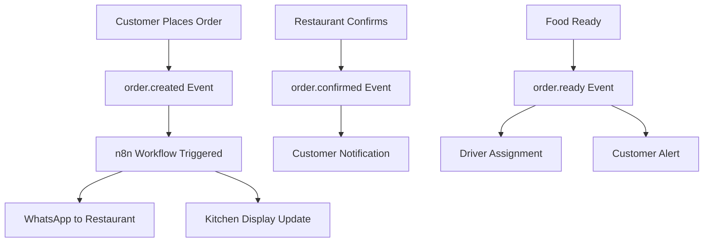

# 🚀 Pizza Falchi n8n Integration - Implementation Complete

## ✅ What Has Been Implemented

### 1. **Webhook Infrastructure**
Complete bidirectional webhook system between Pizza Falchi and n8n:

```
Pizza Falchi → n8n (Order Events)
n8n → Pizza Falchi (Actions & Updates)
```

### 2. **Core Files Created**

#### Webhook System
- `lib/webhooks/dispatcher.ts` - Event dispatcher with retry logic
- `lib/webhooks/signatures.ts` - HMAC-SHA256 signature verification
- `lib/webhooks/retry.ts` - Exponential backoff retry mechanism
- `lib/webhooks/events.ts` - Event emitter for order lifecycle
- `lib/webhooks/schemas.ts` - Zod validation schemas

#### API Endpoints
- `app/api/webhooks/n8n/route.ts` - Webhook receiver from n8n
- **Modified:** `app/api/orders/route.ts` - Emits webhooks on order creation
- **Modified:** `app/api/orders/[id]/route.ts` - Emits webhooks on status changes

#### n8n Client
- `lib/n8n/client.ts` - n8n API client for direct workflow triggers
- `lib/n8n/constants.ts` - Configuration constants and templates

#### Types & Models
- `types/webhooks.ts` - TypeScript interfaces for all webhook types
- **Enhanced:** `models/Order.ts` - Added webhook tracking, delivery, and KDS fields

#### Configuration & Testing
- `.env.example` - Updated with n8n configuration variables
- `scripts/test-webhook.js` - Comprehensive test suite
- `docs/N8N_INTEGRATION_GUIDE.md` - Complete integration documentation

### 3. **Features Enabled**

#### 📱 WhatsApp Notifications
- Order confirmations to restaurant
- Ready notifications to customers
- Delivery updates with tracking

#### 🍕 Kitchen Display System (KDS)
- Order acknowledgment tracking
- Preparation time monitoring
- Station-based workflow

#### 🚗 Delivery Management
- Driver assignment
- Real-time location tracking
- ETA calculations

#### 📊 Event Tracking
- Complete webhook history in orders
- Success/failure tracking
- Retry management

### 4. **Security Features**

- ✅ HMAC-SHA256 signature verification
- ✅ Rate limiting (100 requests/minute)
- ✅ Timestamp validation (5-minute window)
- ✅ CSRF protection on all endpoints
- ✅ Input sanitization with DOMPurify
- ✅ Zod schema validation

## 🔧 How to Use It

### Quick Start

1. **Configure Environment Variables**
   ```bash
   # Copy example and edit
   cp .env.example .env.local

   # Add n8n configuration
   N8N_ENABLED=true
   N8N_WEBHOOK_URL=http://localhost:5678/webhook/pizza-falchi
   N8N_WEBHOOK_SECRET=$(openssl rand -hex 32)
   ```

2. **Start n8n**
   ```bash
   # Terminal 1
   n8n start
   # Open http://localhost:5678
   ```

3. **Start Pizza Falchi**
   ```bash
   # Terminal 2
   npm run dev
   # Open http://localhost:3000
   ```

4. **Test Integration**
   ```bash
   node scripts/test-webhook.js
   ```

### Order Lifecycle Events

When an order is created or updated, the following events are automatically triggered:



### Example: Creating an Order

```javascript
// POST /api/orders
// This automatically triggers:
// 1. order.created webhook to n8n
// 2. WhatsApp notification to restaurant
// 3. Kitchen display update

const order = {
  customerName: "Jean Dupont",
  phone: "+33612345678",
  items: [...],
  deliveryType: "delivery",
  // ... other fields
};
```

### Example: Updating Order Status

```javascript
// PATCH /api/orders/:id
// This automatically triggers status change webhook

{
  status: "confirmed"
}

// Results in:
// - order.confirmed webhook
// - Customer notification
// - KDS update
```

## 📊 Webhook Event Flow

### Events Pizza Falchi → n8n

| Event | Triggered When | n8n Actions |
|-------|---------------|-------------|
| `order.created` | New order placed | Send WhatsApp to restaurant, Update KDS |
| `order.confirmed` | Restaurant accepts | Notify customer, Start preparation timer |
| `order.preparing` | Kitchen starts | Update KDS status, Calculate ETA |
| `order.ready` | Food prepared | Assign driver, Alert customer |
| `order.in_delivery` | Driver departs | Send tracking link, Update ETA |
| `order.completed` | Delivered/Picked up | Send receipt, Request review |
| `order.cancelled` | Order cancelled | Process refund, Notify parties |

### Actions n8n → Pizza Falchi

| Action | Purpose | Updates |
|--------|---------|---------|
| `update_order_status` | Change order status | Order status, webhook events |
| `assign_driver` | Assign delivery driver | Driver info, delivery status |
| `update_kds` | Update kitchen display | KDS status, preparation time |
| `send_notification` | Mark notification sent | Notification channels |
| `update_delivery_status` | Track delivery progress | Location, ETA |
| `cancel_order` | Cancel order | Status, refund info |

## 🧪 Testing

### Manual Test
```bash
# Test webhook health
curl http://localhost:3000/api/webhooks/n8n

# Run full test suite
node scripts/test-webhook.js
```

### Monitor Events
```javascript
// In MongoDB, check webhook events:
db.orders.findOne(
  { _id: orderId },
  { webhookEvents: 1 }
)

// Result shows all webhook attempts:
{
  webhookEvents: [
    {
      eventType: "order.created",
      timestamp: "2024-01-01T12:00:00Z",
      success: true,
      retries: 0
    }
  ]
}
```

## 🔍 Debugging

### Check Logs

```bash
# Pizza Falchi logs
npm run dev
# Look for: "Webhook dispatched: order.created"

# n8n execution logs
# Go to http://localhost:5678
# Click Executions tab in workflow
```

### Common Issues & Solutions

| Issue | Solution |
|-------|----------|
| Webhooks not firing | Check `N8N_ENABLED=true` in .env.local |
| Signature verification fails | Ensure `N8N_WEBHOOK_SECRET` matches in both apps |
| Order not found | Verify order ID exists in MongoDB |
| Rate limiting | Increase limit or implement backoff in n8n |

## 📈 What's Next?

### Recommended n8n Workflows to Create

1. **Order Confirmation Flow**
   - Receive order.created webhook
   - Send WhatsApp to restaurant
   - Wait for response
   - Update order status

2. **Delivery Coordination**
   - Receive order.ready webhook
   - Find available driver
   - Send assignment notification
   - Track delivery progress

3. **Kitchen Display Integration**
   - Receive order events
   - Format for display
   - Calculate prep times
   - Alert on delays

### Additional Features You Can Add

- 📱 SMS fallback for WhatsApp failures
- 📧 Daily order reports
- 📊 Analytics dashboard
- 🔔 Real-time order tracking page
- 💬 Two-way WhatsApp chat
- 📷 Delivery photo confirmation

## 🎯 Key Benefits

1. **Automated Notifications** - No manual messaging needed
2. **Real-time Updates** - Instant status changes
3. **Reliability** - Retry mechanism ensures delivery
4. **Scalability** - Queue system handles high volume
5. **Flexibility** - Easy to add new workflows
6. **Security** - Signed webhooks prevent tampering

## 📞 Support

For issues or questions:
1. Check `docs/N8N_INTEGRATION_GUIDE.md`
2. Review test results: `node scripts/test-webhook.js`
3. Check webhook events in MongoDB
4. Review n8n execution logs

---

**🎉 The n8n integration is now fully implemented and ready to use!**

The system will automatically:
- Send WhatsApp notifications for new orders
- Update kitchen display systems
- Coordinate deliveries
- Track order status changes
- Handle retries for failed webhooks
- Log all webhook events

Start creating your n8n workflows and watch the automation magic happen!