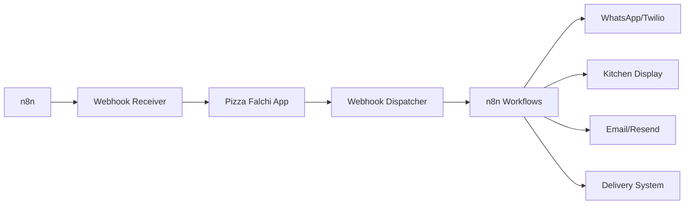

# n8n Integration Guide for Pizza Falchi

## Table of Contents
1. [Overview](#overview)
2. [Architecture](#architecture)
3. [Setup Instructions](#setup-instructions)
4. [Webhook Events](#webhook-events)
5. [API Endpoints](#api-endpoints)
6. [Testing](#testing)
7. [Troubleshooting](#troubleshooting)
8. [Production Deployment](#production-deployment)

## Overview

Pizza Falchi uses n8n for workflow automation, handling:
- 📱 WhatsApp notifications (order confirmations, status updates)
- 🍕 Kitchen Display System (KDS) integration
- 🚗 Delivery coordination
- 📧 Email notifications
- 📊 Analytics and reporting

## Architecture



### Key Components

1. **Webhook Dispatcher** (`lib/webhooks/dispatcher.ts`)
   - Sends events to n8n when orders are created/updated
   - Implements retry logic with exponential backoff
   - Handles webhook signatures for security

2. **Webhook Receiver** (`app/api/webhooks/n8n/route.ts`)
   - Receives webhooks from n8n workflows
   - Updates order status, assigns drivers, etc.
   - Validates signatures and rate limits requests

3. **Event System** (`lib/webhooks/events.ts`)
   - Event emitter for order lifecycle events
   - Supports local and remote listeners
   - Maintains event history

4. **n8n Client** (`lib/n8n/client.ts`)
   - Direct API calls to n8n workflows
   - Helper functions for common operations
   - Health checking and monitoring

## Setup Instructions

### Prerequisites

1. **n8n Installation**
   ```bash
   # Using npm
   npm install -g n8n

   # Using Docker
   docker run -it --rm \
     --name n8n \
     -p 5678:5678 \
     -v ~/.n8n:/home/node/.n8n \
     n8nio/n8n
   ```

2. **Environment Variables**
   Copy `.env.example` to `.env.local` and configure:
   ```env
   # Required n8n settings
   N8N_ENABLED=true
   N8N_BASE_URL=http://localhost:5678
   N8N_WEBHOOK_URL=http://localhost:5678/webhook/pizza-falchi
   N8N_WEBHOOK_SECRET=<generate-with-openssl-rand-hex-32>
   ```

### Step 1: Start n8n

```bash
# Terminal 1
n8n start
# Access n8n at http://localhost:5678
```

### Step 2: Import Workflows

1. Open n8n UI at http://localhost:5678
2. Go to Settings > Import
3. Import these workflow files from `C:\Users\jfpru\pizza-falchi-integration\workflows\`:
   - `pizza-order-processor.json`
   - `restaurant-response-handler.json`
   - `order-status-notifier.json`

### Step 3: Configure Webhook URLs

In each n8n workflow, update the webhook nodes:

1. **Order Processor Workflow**
   - Webhook URL: `http://localhost:5678/webhook/pizza-order-processor`
   - HTTP Method: POST
   - Authentication: Header Auth
   - Header Name: `X-Webhook-Secret`
   - Header Value: Your webhook secret

2. **Pizza Falchi Callback**
   - URL: `http://localhost:3000/api/webhooks/n8n`
   - Add headers:
     - `X-Webhook-Signature`: `{{$json.signature}}`
     - `X-Webhook-Timestamp`: `{{$json.timestamp}}`

### Step 4: Start Pizza Falchi

```bash
# Terminal 2
cd pizza-falchi
npm run dev
```

## Webhook Events

### Events Sent by Pizza Falchi

| Event | Description | When Triggered |
|-------|-------------|----------------|
| `order.created` | New order placed | Customer completes checkout |
| `order.confirmed` | Order accepted | Restaurant confirms order |
| `order.preparing` | Kitchen started | Chef begins preparation |
| `order.ready` | Ready for pickup/delivery | Food preparation complete |
| `order.in_delivery` | Out for delivery | Driver picks up order |
| `order.completed` | Order delivered/picked up | Customer receives order |
| `order.cancelled` | Order cancelled | Any cancellation |

### Event Payload Structure

```typescript
{
  eventId: "uuid-v4",
  eventType: "order.created",
  timestamp: "2024-01-01T12:00:00Z",
  webhookVersion: "1.0",
  data: {
    orderId: "507f1f77bcf86cd799439011",
    orderNumber: "ORD-2024-001",
    customer: {
      name: "John Doe",
      phone: "+33612345678",
      email: "john@example.com",
      deliveryAddress: {
        street: "123 Rue Example",
        city: "Ajaccio",
        postalCode: "20000"
      }
    },
    items: [
      {
        productId: "pizza-margherita",
        productName: "Pizza Margherita",
        quantity: 2,
        price: 12.50,
        totalPrice: 25.00
      }
    ],
    totalAmount: 25.00,
    deliveryType: "delivery",
    paymentMethod: "card",
    paymentStatus: "paid"
  }
}
```

## API Endpoints

### Webhook Receiver

**POST** `/api/webhooks/n8n`

Receives webhooks from n8n workflows.

#### Request Headers
```
X-Webhook-Signature: <hmac-sha256-signature>
X-Webhook-Timestamp: <unix-timestamp>
Content-Type: application/json
```

#### Request Body
```json
{
  "action": "update_order_status",
  "orderId": "507f1f77bcf86cd799439011",
  "data": {
    "status": "confirmed",
    "statusReason": "Order accepted by restaurant"
  }
}
```

#### Supported Actions

| Action | Description | Required Data |
|--------|-------------|---------------|
| `update_order_status` | Change order status | `status`, `statusReason` |
| `assign_driver` | Assign delivery driver | `driver` object |
| `update_kds` | Update kitchen display | `kdsStatus`, `preparationTime` |
| `send_notification` | Send customer notification | `channel`, `message` |
| `update_delivery_status` | Update delivery progress | `deliveryStatus`, `currentLocation` |
| `cancel_order` | Cancel order | `cancellationReason` |

### Health Check

**GET** `/api/webhooks/n8n`

Returns webhook endpoint status.

#### Response
```json
{
  "success": true,
  "message": "n8n webhook endpoint is active",
  "version": "1.0",
  "timestamp": "2024-01-01T12:00:00Z"
}
```

## Testing

### Manual Testing

1. **Test Order Creation**
   ```bash
   curl -X POST http://localhost:3000/api/orders \
     -H "Content-Type: application/json" \
     -d '{
       "customerName": "Test Customer",
       "phone": "+33612345678",
       "email": "test@example.com",
       "deliveryType": "delivery",
       "deliveryAddress": {
         "street": "123 Test Street",
         "city": "Ajaccio",
         "postalCode": "20000"
       },
       "items": [{
         "product": "pizza-id",
         "quantity": 1,
         "price": 15.00,
         "total": 15.00
       }],
       "subtotal": 15.00,
       "deliveryFee": 2.50,
       "total": 17.50,
       "paymentMethod": "card"
     }'
   ```

2. **Test Webhook Reception**
   ```bash
   # Generate test signature
   SECRET="your-webhook-secret"
   TIMESTAMP=$(date +%s)
   PAYLOAD='{"action":"update_order_status","orderId":"test","data":{"status":"confirmed"}}'
   SIGNATURE=$(echo -n "$TIMESTAMP.$PAYLOAD" | openssl dgst -sha256 -hmac "$SECRET" -hex)

   # Send webhook
   curl -X POST http://localhost:3000/api/webhooks/n8n \
     -H "Content-Type: application/json" \
     -H "X-Webhook-Signature: $SIGNATURE" \
     -H "X-Webhook-Timestamp: $TIMESTAMP" \
     -d "$PAYLOAD"
   ```

### Automated Testing

Run the test script from Terminal 1:
```bash
cd C:/Users/jfpru/pizza-falchi-integration/tests
python test-pizza-order.py
```

### Webhook Event Monitoring

Monitor webhook events in real-time:

1. **In Pizza Falchi logs:**
   ```
   npm run dev
   # Watch for "Webhook dispatched" messages
   ```

2. **In n8n UI:**
   - Open workflow
   - Click "Executions" tab
   - View real-time execution logs

3. **MongoDB:**
   ```javascript
   // Check webhook events in order documents
   db.orders.findOne({ _id: orderId }, { webhookEvents: 1 })
   ```

## Troubleshooting

### Common Issues

1. **Webhook Signature Verification Failed**
   - Ensure `N8N_WEBHOOK_SECRET` matches in both apps
   - Check timestamp isn't too old (5-minute window)
   - Verify HMAC calculation

2. **Webhooks Not Firing**
   - Check `N8N_ENABLED=true` in `.env.local`
   - Verify n8n is running and accessible
   - Check network connectivity between apps

3. **Rate Limiting**
   - Default: 100 requests per minute per IP
   - Increase limit in webhook receiver if needed
   - Implement exponential backoff in n8n workflows

4. **Order Status Not Updating**
   - Verify order ID exists in database
   - Check webhook action is valid
   - Review MongoDB connection

### Debug Mode

Enable detailed logging:
```env
LOG_LEVEL=debug
LOG_WEBHOOK_EVENTS=true
```

### Health Checks

```bash
# Check n8n health
curl http://localhost:5678/healthz

# Check webhook endpoint
curl http://localhost:3000/api/webhooks/n8n

# Test webhook dispatcher
curl http://localhost:3000/api/webhooks/n8n/test
```

## Production Deployment

### Security Checklist

- [ ] Generate strong webhook secret (min 32 characters)
- [ ] Use HTTPS for all webhook URLs
- [ ] Configure rate limiting appropriately
- [ ] Enable webhook signature verification
- [ ] Use environment-specific secrets
- [ ] Monitor webhook failures
- [ ] Set up alerting for critical failures

### Environment Variables

```env
# Production settings
N8N_ENABLED=true
N8N_BASE_URL=https://n8n.pizzafalchi.com
N8N_WEBHOOK_URL=https://n8n.pizzafalchi.com/webhook/prod-pizza
N8N_WEBHOOK_SECRET=<production-secret>
N8N_RETRY_ATTEMPTS=5
N8N_RETRY_DELAY_MS=2000
N8N_TIMEOUT_MS=30000
```

### Monitoring

1. **Webhook Delivery Metrics**
   - Success rate
   - Average latency
   - Retry count
   - Failure reasons

2. **Order Processing Metrics**
   - Orders per hour
   - Status transition times
   - Notification delivery rate
   - Customer response time

3. **System Health**
   - n8n workflow execution time
   - MongoDB query performance
   - API response times
   - Error rates

### Backup Strategies

1. **Webhook Retry Queue**
   - Failed webhooks are queued for retry
   - Exponential backoff prevents overload
   - Dead letter queue for permanent failures

2. **Fallback Notifications**
   - Direct WhatsApp API if n8n fails
   - Email as backup channel
   - SMS for critical notifications

## Advanced Configuration

### Custom Webhook Events

Add new events in `types/webhooks.ts`:
```typescript
export enum WebhookEventType {
  // Add your custom event
  CUSTOM_EVENT = 'custom.event',
}
```

### Custom n8n Actions

Add actions in webhook receiver:
```typescript
case 'custom_action':
  // Your custom logic
  break;
```

### Webhook Filtering

Filter events by type:
```typescript
const dispatcher = getWebhookDispatcher();
dispatcher.setEnabledEvents([
  WebhookEventType.ORDER_CREATED,
  WebhookEventType.ORDER_READY,
]);
```

## Support

For issues or questions:
1. Check the [Troubleshooting](#troubleshooting) section
2. Review n8n execution logs
3. Check MongoDB for webhook events
4. Contact support with webhook event IDs

## Appendix

### Webhook Signature Verification

Pizza Falchi uses HMAC-SHA256 for webhook signatures:

```javascript
const signature = crypto
  .createHmac('sha256', secret)
  .update(`${timestamp}.${payload}`)
  .digest('hex');
```

### Rate Limiting

Default limits:
- Webhook receiver: 100 requests/minute
- Order creation: 10 orders/minute
- Status updates: 50 updates/minute

### Event History

Events are stored in MongoDB for 30 days:
- Order document: `webhookEvents` array
- Maximum 100 events per order
- Automatic cleanup of old events